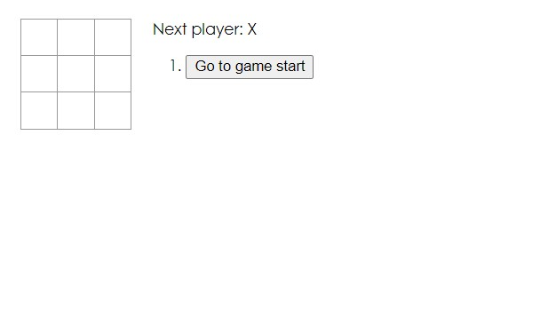
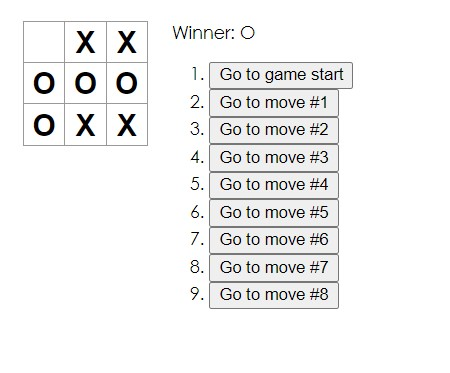

# React - Intro to React Tutorial - Tic Tac Toe

This is a solution to the [Tutorial: Intro to React](https://reactjs.org/tutorial/tutorial.html).

## Table of contents

- [Overview](#overview)
  - [The challenge](#the-challenge)
  - [Screenshot](#screenshot)
  - [Links](#links)
- [My process](#my-process)
  - [Built with](#built-with)
  - [What I learned](#what-i-learned)
- [Author](#author)

## Overview

### The challenge

Users should be able to:

- Play tic-tac-toe
- See when a player has won the game
- Access a game’s history as a game progresses
- Review a game’s history and see previous versions of a game’s board

### Screenshot

### Links

- [Solution URL](https://github.com/kowai-onigiri/my-app)
- [Live Site URL](https://626202229bdc5a7b61c7fbcd--gentle-selkie-656702.netlify.app/)

## My process

### Built with

- Semantic HTML5 markup
- CSS custom properties
- [React](https://reactjs.org/) - JS library

### What I learned

- first attempt at using React 

### Continued development

I would like to stylize the tic tac toe board to make the UI more visually pleasing.

## Author

- Alexis Chambers - [@kowai-onigiri](https://github.com/kowai-onigiri)

